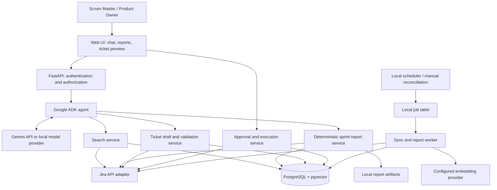

# Scrum Master Jira Assistant — product requirements and architecture

Status: design reviewed; revisions from the 2026-09-27 review applied. Week 1 Jira foundation is implemented; the ADK application is not yet implemented.
Date: 2026-09-27. Revision summary: local-PC runtime, export sanitization, local asynchronous report execution, create correlation markers, batched permission rechecks, changelog-driven history, measured cost parameters, pilot configuration mechanics and scoped-token facts.

## 1. Product brief

Build an internal assistant that reduces a Scrum Master's time spent finding work, assembling sprint reports, and preparing clear Jira tickets. The user requested Google ADK and a vector-store recommendation. Success means useful answers supported by Jira evidence, reproducible sprint metrics, and ticket changes that follow the team's agreed conventions.

Provisional assumptions: Jira Cloud; one user; English-first web interface; the application runs on the user's PC and binds to loopback (`127.0.0.1`) only; interactive use first; explicit review before each Jira write. Google ADK and a Gemini provider may make outbound model/embedding API calls, but Google Cloud deployment is not required. Jira Data Center would change authentication, API adapters, networking, and some field handling.

Primary user: Scrum Master. Secondary users: Product Owner reviewing backlog quality and team members finding context. An administrator configures projects, boards, permissions, and team templates. App roles never grant additional Jira permissions.

## 2. MVP requirements

| ID | User need | Acceptance criteria |
|---|---|---|
| FR-01 | Connect Jira and select context | User signs in, connects their Jira identity, selects an accessible site, project and board; custom fields and board settings are discovered. |
| FR-02 | Search in natural language | Supports exact issue keys and structured filters such as sprint, status, assignee and labels; results contain issue links, relevant evidence and freshness. Ambiguous sprint names trigger a selection. |
| FR-03 | Find related work | Semantic search finds similar issues and possible duplicates; hard filters and permissions still apply. Similarity is presented as a suggestion, never proof of duplication. |
| FR-04 | Report on a selected sprint | Accepts board plus sprint ID, or resolves a name; supports active and closed sprints; returns metrics, issue lists, blockers, scope changes and narrative with sources. Missing history is disclosed. |
| FR-05 | Draft a ticket | Selects Story, Bug or Task template; incorporates approved team guidance; marks missing information; shows possible duplicates; produces an editable preview. |
| FR-06 | Update a ticket | Fetches the latest ticket, proposes a field-level diff, preserves unrelated content, validates editable fields and requires review before applying. |
| FR-07 | Apply an approved draft | Approval is tied to user, Jira target and exact payload; permission and freshness are checked again; success is reported only after verifying the result in Jira. |
| FR-08 | Configure team standards | Versioned project/issue-type templates specify required sections, custom field mappings, readiness rules, definition of done and estimation policy. |
| FR-09 | Inspect provenance | Report and change records retain source IDs, timestamps, configuration versions and outcomes; user can open the underlying Jira issues. |
| FR-10 | Export reports | MVP provides Markdown and CSV downloads with the same authorized data and provenance as the on-screen report. |

Release scope: the personal pilot (roadmap Weeks 1–12) delivers FR-01 through FR-10 for one allowlisted user, one Jira site and one supported board. Shared-team administration, multi-user isolation and hosted operation are out of scope.

Example requests:

- “Show unresolved payment bugs in the current sprint on the Payments board.”
- “Report on Sprint 24: committed work, completed work, scope changes and blockers.”
- “Find tickets similar to users being charged twice after retrying checkout.”
- “Draft a story for downloading invoices using our team's ticket template.”
- “Add these acceptance criteria to PAY-123 and show me the changes.”

MVP exclusions: autonomous prioritization or estimation, bulk writes, deleting issues, moving or closing sprints, automatic workflow transitions, individual performance scoring, unattended report distribution, attachment ingestion and meeting transcription. Epic generation, Confluence ingestion, scheduled reports and team-chat integrations are later increments.

## 3. Ticket quality policy

There is no single universal “agile Jira ticket standard.” Use a configurable team policy, with helpful defaults informed by common user-story practice. Atlassian describes the role/goal/benefit story format and refinement practices in its [user-story guidance](https://www.atlassian.com/agile/project-management/user-stories).

| Type | Proposed template |
|---|---|
| Story | Outcome-oriented title; user and business context; role/goal/benefit statement; scope and exclusions; testable acceptance criteria; dependencies; relevant nonfunctional requirements; open questions. |
| Bug | Observable problem; environment/version; reproduction steps; expected and actual behavior; impact; evidence; verification criteria. |
| Task | Objective; context; scope; deliverables; dependencies; completion checklist. |

Acceptance criteria may use Given/When/Then when useful; this is not compulsory for every ticket. INVEST is a qualitative review aid: independent, negotiable, valuable, estimable, small and testable. The assistant should explain specific weaknesses rather than invent a precise quality score.

Separate three checks: Jira schema validity, mandatory team rules, and advisory writing quality. Only the first two are hard validation failures. Project metadata determines required fields and valid values. Team-configured readiness rules determine whether a draft is ready for refinement or creation; incomplete drafts can still be saved locally.

Do not invent business rules, reproduce steps never supplied, infer assignees, or set estimates as facts. Unknown mandatory details become questions. Estimates, priority, assignee and sprint placement remain explicit human choices. Acceptance criteria concern an individual item; definition of done is a shared team standard and should be referenced by version.

Pilot configuration mechanics: team templates, board mappings and report policies are versioned YAML files in the repository, loaded with their version recorded in the database. An administrative interface for them is deferred to the shared-team phase.

## 4. Sprint reporting contract

Every report records site, board ID, sprint ID, sprint goal, reporting timezone, start time, cutoff time, generation time, metric-policy version and data completeness. Active sprint cutoff is the requested observation time; closed sprint cutoff is actual completion time when available. Planned end time remains a separate field.

The reporting service computes numbers in Python/SQL. The language model explains those computed results and cites evidence. It does not calculate totals from vector results or a sample of retrieved tickets.

Definitions set by the Week 1 metric-policy decision record ([ADR-0002](../../decisions/0002-metric-policy.md)); the report record carries the metric-policy version, and changes require a new policy version:

| Metric | Definition |
|---|---|
| Committed work | Initial planned scope: unique issues in the sprint at its start, from changelog membership events; estimates as recorded at that time. Missing estimates are unknown, not zero. |
| Completed during sprint | Issues that first entered a configured done state after sprint start and are in a done state at cutoff. Done-before-start is excluded. |
| Done by end | Issues in a done state at cutoff, whenever entered. Reported separately from completed-during-sprint. |
| Commitment completion | Committed issues completed during the sprint divided by all committed issues. A point-based version uses start-time estimates in numerator and denominator. Zero denominator is N/A. |
| Scope changes | Membership additions and removals during the sprint, including timestamps and estimates at the event. Estimate changes are reported separately. |
| Reopened work | Issues done during the sprint but not done at cutoff; excluded from completed-during-sprint, listed separately and counted as unfinished. |
| Pre-closure state | Issue state immediately before sprint close (at the observation cutoff for active sprints); the basis for rollover classification and for separating unfinished original commitment, unfinished additions and removed commitment. |
| Unfinished work | Issues still in sprint scope at cutoff that are not done, distinguished per pre-closure state. |
| Carryover | Unfinished work observed moving into a later sprint; without that evidence, label it unfinished, not proven carryover. |
| Velocity trend | Completed-during-sprint estimates for recent closed sprints on the same board using the same estimate unit and metric policy. Show sample size; do not aggregate different teams' point scales. |
| Blockers | Explicit blocker flags, configured blocked statuses and issue links. Narrative concerns inferred from text are labeled separately. |

Resolve “done” from configured board columns/status mapping and version that mapping; do not assume a status literally named Done. Treat missing estimates as unknown rather than zero, display estimate coverage, and avoid counting both parent and subtask estimates unless the team's policy explicitly calls for it.

Historical accuracy requires complete relevant issue changelogs: sprint membership additions and removals, status transitions and estimate changes are recorded in issue history with timestamps, so closed-sprint metrics are primarily changelog-driven. Today’s sprint membership query can still miss removed issues, so ingest the configured project scope and build the sprint universe from changelog membership events, using issue snapshots as cross-checks and for fast reassembly rather than as the primary source. Snapshots are required where changelogs cannot answer: board filter/configuration history, deleted issues, and field values overwritten before ingestion. For older sprints, reconstruct only where sufficient evidence exists. Deleted or inaccessible issues may leave gaps. Never claim parity with Jira’s native sprint report until tested against the actual board configuration.

If history cannot establish original commitment, return the available status summary and mark commitment/scope-change metrics unavailable or partial. If access is limited, label the report as covering only authorized issues. “No data” and “zero” must remain distinct.

## 5. Architecture options and decision

| Option | Benefit | Tradeoff | Decision |
|---|---|---|---|
| ADK agent with live Jira tools only | Quickest route to exact search, current-state reports and drafting | Weak similarity search and limited historical reporting without stored snapshots | Useful first milestone. |
| ADK plus PostgreSQL/pgvector | Structured history, approvals and semantic retrieval share one database | Requires synchronization and permission-aware retrieval | Recommended target for MVP. |
| ADK plus dedicated vector service and relational database | Independent retrieval scaling and specialized search features | Extra service, duplicated metadata and more synchronization | Revisit after measured need. |

Build a modular Python application that runs as a local FastAPI process on the user's PC, listening only on `127.0.0.1`. Start with one ADK conversational agent and typed domain tools. Search, reporting and ticket workflows are separate modules; introduce specialist agents only if evaluation shows a benefit. Use a Gemini API key from Google AI Studio for the preferred local model path; Vertex AI, `gcloud`, infrastructure provisioning and all deployment commands are excluded. ADK supports both simple agents and larger workflows; see [agent architecture](https://google.github.io/adk-docs/agents/) and [function tools](https://google.github.io/adk-docs/tools-custom/function-tools/).

The diagram below is the target local architecture. Run one local FastAPI process containing the UI, ADK agent and typed services. Run synchronization and report jobs in the same process or as a separately started local worker using a durable PostgreSQL job table; a local scheduler (for example, cron or Task Scheduler) can invoke reconciliation while the PC is on. Webhooks are not part of the PC-only pilot because the laptop is not a stable public endpoint; scheduled polling is the source of freshness, and reports disclose gaps when the process was stopped. The local design keeps module boundaries so hosting can be reconsidered later without making cloud deployment a Week 1–12 requirement.

The approval route is an authenticated application operation; the model cannot approve its own draft. API identity and Jira credentials are injected by trusted server code, never selected from model arguments.

## 6. Suggested stack and responsibilities

| Layer | Recommendation |
|---|---|
| Agent framework | Google ADK for Python; pin a tested SDK version at implementation. |
| Generation | Gemini API key from Google AI Studio (preferred local ADK path) or a local model provider; Vertex AI is excluded. Choose the exact model using task evaluations, latency, privacy and cost. |
| Backend | FastAPI, Pydantic schemas, a typed HTTP Jira adapter, SQLAlchemy and database migrations. |
| Frontend | Pilot: server-rendered HTML (Jinja/HTMX) with chat, source links, sprint selector, report view and diff approval. A React/TypeScript SPA replaces it in the shared-team phase if the pilot outgrows server rendering. |
| Database | PostgreSQL with pgvector on the PC, preferably in Docker; SQLite is acceptable for the first live-read milestone before history/vector features. |
| Embeddings | Benchmark `gemini-embedding-001` with a reduced 768-dimensional output as an initial text-only baseline; confirm availability at implementation. |
| Runtime | Local FastAPI/ADK process bound to `127.0.0.1`, plus an optional local worker and OS scheduler (cron/Task Scheduler). Never expose the pilot through a public URL. |
| Sessions | Persistent ADK session service with user isolation; separate schemas for sessions and application records. |
| Files | Local report directory with authorization checks in the application; keep it outside Git and back it up using the user's normal PC controls. |
| Credentials | Environment variables or a local `.env` excluded from Git; prefer the OS credential store for longer-lived secrets. Never put tokens in source files or model prompts. |
| Operations | Structured logs, request tracing, model/tool latency and cost metrics; redaction of tokens and sensitive issue content. |

Persist sessions, jobs, approvals and artifacts in local durable storage rather than process memory. Current [ADK action-confirmation documentation](https://google.github.io/adk-docs/tools-custom/confirmation/) lists limitations with some session services; therefore durable approvals remain application records, independent of that feature's compatibility. If Gemini is selected, model calls still require network access and the applicable Google AI credentials; that is a provider dependency, not a deployment requirement.

The proposed embedding configuration is a benchmark starting point, not a claim that it is best for this dataset. Pin model ID, dimension, task type and normalization behavior; document/query embeddings must use compatible settings. Generate embeddings through the selected provider's local/API client and store them in local PostgreSQL. Do not add Vertex AI or a managed vector service to this pilot.

Cost parameters for the pilot, to be measured rather than assumed. Distinguish sprint size (the agreed 500-issue reporting dataset) from total indexed issues — membership reconstruction requires project-wide changelog history, not only current sprint members — plus historical lookback depth and daily request volume. Model-call volume depends on the number of model/tool interaction rounds. Multiple tool calls may be requested in one model response and share a round, so tool-call count alone does not determine model-call count. Measure model calls, tokens and provider cost per completed task in Weeks 2–3; if a local model is used, record local compute/runtime instead.

## 7. Vector recommendation and retrieval design

**Recommend local PostgreSQL + pgvector.** The assistant already needs relational records for sprint history, permissions, report provenance and approval transactions. Keeping vectors with these records simplifies operation and filtering. Run PostgreSQL locally (Docker is optional) and back up the data using the user's normal PC process.

| Alternative | When to consider it |
|---|---|
| Qdrant | Choose when independent vector scaling and advanced dense/sparse retrieval are demonstrated needs. It offers [hybrid queries](https://qdrant.tech/documentation/search/hybrid-queries/) and [metadata filtering](https://qdrant.tech/documentation/search/filtering/); retain PostgreSQL for application transactions. |
| Managed vector service | Out of scope for the PC-only pilot. Reconsider only if a later user explicitly requests shared access or the local corpus outgrows PostgreSQL/pgvector. |

Index approved ticket examples, issue summaries/descriptions and team guidance. Start without comments or attachments; add them only with their own visibility rules. Ticket content is evidence, not authority to change rules. Retrieve mandatory templates by exact project/type/version, not by similarity alone.

Retrieval flow:

1. Resolve authenticated user, site and project scope. Exact keys and structured questions use Jira APIs/JQL directly.
2. For semantic questions, query metadata-filtered vector and PostgreSQL full-text indexes. Fuse ranked results and deduplicate by issue/source.
3. Treat permissions in the index as candidate filters, not definitive authorization. Recheck candidates before their text enters model context with one batched query executed using the requesting user's Jira identity (for example JQL `issuekey IN (...)`), not per-issue requests; user-scoped tokens make Jira itself the permission authority for live reads. Application-level rechecks therefore target stored paths — history, embeddings, exports and caches. Omit results when authorization cannot be verified.
4. Pass authorized evidence to the model with source links and retrieval timestamps. Re-fetch current fields when describing live status. Fetch authoritative document revisions or omit stale sources when access/revision cannot be verified.
5. Keep an explicit distinction between related examples and actual requirements.

Jira Cloud descriptions are Atlassian Document Format: chunk by walking ADF nodes (paragraphs, lists, tables, panels) rather than splitting raw text, preserving source identity and headings. Index the summary as its own chunk — titles carry most of the similarity signal — alongside description chunks with separately tuned weighting. Store site, project, issue/document ID, source URL, content hash, source update time, access metadata and embedding version with each chunk. Use approximate indexes only when benchmarks justify them; test filtered recall. Changing models requires a new index version and re-embedding, not mixing vector spaces.

## 8. Domain tools and Jira integration

Expose narrow tools such as `resolve_sprint`, `search_issues`, `get_issue`, `find_similar_issues`, `build_sprint_report`, `get_report`, `get_ticket_template`, `draft_issue`, `propose_issue_update` and `validate_draft`. Their return schemas include data, sources, timestamp, completeness and structured errors. Report generation may be asynchronous: `build_sprint_report` creates a durable local job row and returns a job handle; a local worker processes it and `get_report` returns status/results. Jobs must survive process restart, and application idempotency must handle duplicate local execution. Do not expose unrestricted HTTP, SQL or arbitrary code execution to the model.

Use Jira Cloud REST v3 for issues, fields and changelogs, and Jira Software APIs for boards/sprints. Prefer the enhanced JQL search endpoints under `/rest/api/3/search/jql`, respecting pagination. Discover create/edit field metadata, custom field IDs and hierarchy rules rather than hard-coding them. Encode rich text in the required Jira document format. These boundaries follow the [issue search API](https://developer.atlassian.com/cloud/jira/platform/rest/v3/api-group-issue-search/), [issue API](https://developer.atlassian.com/cloud/jira/platform/rest/v3/api-group-issues/), [board API](https://developer.atlassian.com/cloud/jira/software/rest/api-group-board/) and [sprint API](https://developer.atlassian.com/cloud/jira/software/rest/api-group-sprint/).

For this PC-only pilot, use the user's own scoped API token stored outside source control. Scoped tokens must call the central `api.atlassian.com/ex/jira/{cloudId}` endpoints; confirm endpoint compatibility with the adapter. Monitor token expiry. OAuth 3LO and multi-user identity are out of scope until a separate shared-team requirement is approved. A broad service account must not become a way to expose issues that users cannot access.

Direct typed REST tools are the default for predictable report completeness, pagination and controlled writes. An approved Jira MCP integration can be an adapter if it exposes the required operations and equivalent authorization guarantees; it is not a mandatory dependency.

## 9. Durable ticket changes

State progression: draft → validated → awaiting review → approved → executing → succeeded, failed, conflicted or outcome unknown. Rejected and expired are terminal review states. Editing a reviewed payload invalidates approval.

Persist the exact proposed fields, target, original relevant fields, template version, payload hash, creator, approver, expiry and execution ID. The execution service authenticates the approving user, checks Jira permissions/metadata, re-reads relevant fields and rejects a stale diff before writing. Serialize app-originated writes per issue. Do not assume Jira offers atomic compare-and-swap on all fields: a small race with external edits remains, so patch only intended fields and verify afterward.

Use unique application request IDs and durable execution records to prevent duplicate submissions inside the app. A timed-out Jira create request may already have succeeded. Do not blindly retry it: Jira create has no idempotency support, so make executions findable instead — write a unique correlation marker (for example a label `scrum-agent-req:<uuid>` or a description footer) as part of the create payload and reconcile a timeout by searching for that marker. Mark the outcome unknown for review only when the marker cannot be found after Jira settles. Never promise distributed exactly-once execution from an application idempotency key alone. Partial multi-step actions must expose completed and pending steps; keep MVP writes to a single issue operation when possible. Once duplicate detection exists (section 7), approval of a create may surface a near-duplicate warning; a warning informs the approver and never silently blocks an approved payload.

## 10. Data, synchronization and protection

Logical records: users/Jira connections; project and board configuration versions; issue snapshots; changelog events; sprints and membership events; ticket templates; document chunks/embeddings; report runs and metric inputs; change proposals/approvals/executions; audit events; sync checkpoints.

Every relevant record is scoped by Jira site and project, with user ownership or access rules where needed. Store timestamps in UTC and render in the configured team timezone. Keep chat memory separate from authoritative Jira history and team policies.

Initial indexing is bounded to selected projects. Process all pages and record coverage. For the pilot, ingest using the user's authorized connection; a shared index requires candidate authorization as above. Use scheduled incremental polling with overlap and periodic reconciliation to catch missed events; public webhooks are out of scope for a PC-only runtime. Remove/tombstone deleted and inaccessible content and invalidate obsolete embeddings. Maintain retention for conversations and report exports separately from the history needed for agreed reporting.

The PC-only pilot uses scheduled polling only; do not register webhooks or expose public ingress. Treat each poll as a change hint and reconcile against authoritative Jira data. Retrieved issue text is untrusted: it cannot change tool permissions, select credentials or approve writes. It also cannot inject into outputs: sanitize CSV exports against spreadsheet formula injection (cells beginning with `=`, `+`, `-` or `@`) and escape HTML/Markdown in rendered report views and exports. Enforce scope at service boundaries, including exports and cached reports. Cache keys must include access scope; a report generated with wider permissions cannot be reused for a narrower user without rebuilding it.

On Jira rate limits, honor Retry-After and use bounded retries/backoff. API/model outages produce clear partial results or resumable jobs, never fabricated completion. Limit tool calls, retrieval size, output tokens and execution duration. Verify the selected model provider's privacy/retention terms before ingesting real issue content.

## 11. Release criteria and evaluation

These are proposed acceptance targets, not measured results:

- Exact-search and sprint-resolution fixtures return the expected authorized issue set, including pagination.
- Sprint metric fixtures match hand-checked expected results for scope removal/re-addition, estimate edits, reopened issues, missing estimates, subtask policies, timezone boundaries and incomplete history.
- At least 90% of a team-labeled set of 50 semantic queries return a relevant result in the top five; report duplicate-suggestion precision separately.
- All generated tickets pass Jira/schema and mandatory team validation before becoming executable; a Product Owner reviews a representative draft set for usefulness and unsupported assumptions.
- Authorization tests cover issue security, revocation, cross-user sessions/caches and exports; no unauthorized source content reaches model context. Export tests cover spreadsheet-formula and markup injection from issue text.
- Fixtures and evaluation sets derived from real tickets are anonymized before entering the repository; no colleague-identifying data in tests or eval sets.
- Approval tests cover edited payloads, expiry, wrong user, restarts, concurrent edits, repeated submission and unknown create outcomes.
- Normal-load target: p95 search response under 10 seconds and p95 report under 60 seconds for an agreed pilot dataset of at most 500 sprint issues after initial ingestion. Larger or history-heavy reports become background jobs. Measure these before making a service commitment.
- Pilot outcome: reduce median manual report preparation time by at least 50%, measured against a baseline over several sprints, while users can verify every reported metric.

Track factual correctness, source validity, retrieval quality, write correctness, user edits to drafts, latency and cost independently. Model/prompt/ADK upgrades must rerun the relevant evaluations.

## 12. Delivery sequence and remaining decisions

See the [weekly delivery roadmap](../plans/2026-09-27-weekly-delivery-roadmap.md) for a 12-week PC-only personal-pilot sequence, weekly goals and exit checks. It assigns the design review findings to specific weeks and narrows the release to one user and one supported board.

1. Foundation and exact search: Jira connection, board/field discovery, identity checks and ADK read tools. Validate on a sandbox project.
2. Sprint reporting: establish snapshots/history ingestion and deterministic metrics, then add narrative and exports. Begin snapshot collection early.
3. Ticket drafting and updates: versioned templates, previews, durable approvals, guarded execution and audit.
4. Semantic retrieval: add pgvector, embeddings, hybrid retrieval and duplicate suggestions after an exact-search baseline exists.
5. Pilot hardening: evaluate with the Scrum Master/PO, observe costs and failures, tune retrieval and release to the initial teams.

Confirm before implementation: Jira Cloud versus Data Center; local PC as the runtime; loopback-only binding; initial projects/boards and approximate issue count; actual ticket examples and custom fields; report definitions and output destinations; model provider/API privacy choice; and local backup policy. Pilot authentication uses a scoped personal token (scopes selected, 1–365 day expiry, `api.atlassian.com` endpoints). OAuth 3LO, Vertex AI, public webhooks, multi-user hosting and all deployment commands are out of scope for the PC-only pilot. Until answered, use the explicit assumptions in section 1 and treat sizing choices as provisional.

This document provides the requested requirements and architecture. A detailed implementation plan and application build are subsequent work after the design is reviewed.
