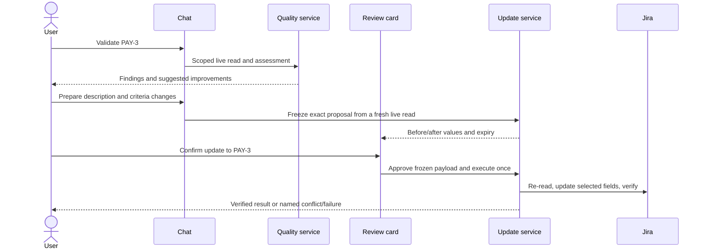

# Ticket Quality Validation and Confirmed Updates

**Status:** Proposed  
**Date:** 2026-10-03

## Goal

Extend the local Scrum Master Jira assistant so a user can assess an existing Story,
Bug, or Task against the team's agile writing guidance, prepare concrete improvements,
and update Jira only after explicitly confirming the exact changes.

Validation, draft improvement, revision, cancellation, and a chat message such as
"yes" must never write to Jira. The first release confirms only through a
server-rendered **Confirm update** control that identifies the ticket and payload.

## Existing foundation

The repository already has a safe backend update path in
`scrum_agent.ticketing.updates`:

1. Read the live issue and freeze a field-level diff.
2. Store a proposal.
3. Record approval.
4. Re-read the reviewed fields before writing.
5. Send only the reviewed Jira fields and read them back to verify the result.

It supports `summary`, `description`, `acceptance_criteria`, `labels`, and
`due_date`. The agent chat is currently read-only, so it cannot validate ticket
quality or expose that update path safely to the user.

## Quality policy

Create a versioned `quality-v1` policy under a new `scrum_agent.quality` package.
It has three categories so the agent does not misrepresent a local convention as a
Scrum rule:

| Category | Meaning | Effect |
| --- | --- | --- |
| Jira required | A field or value Jira requires according to live edit metadata | Blocks an update |
| Team policy | Expectations taken from the existing Story/Bug/Task templates | Reports a writing gap |
| Advisory | Useful refinement advice | Never blocks alone |

The Scrum Guide asks for clear Product Backlog Items and leaves detailed refinement
practices to the Scrum Team. INVEST and Given/When/Then are helpful lenses, not
mandatory Jira formats. Acceptance criteria for one ticket also do not replace the
team's Definition of Done.

| Type | Team-policy checks | Advisory checks |
| --- | --- | --- |
| Story | user/beneficiary, goal, value, scope boundary, observable acceptance criteria | INVEST, error cases, whether the item should be split |
| Bug | observable problem, environment, reproduction, expected/actual result, impact, verification criteria | evidence, workaround, regression coverage |
| Task | objective, scope/deliverables, completion checklist | dependencies and context |

The policy accepts meaningful prose, lists, and headings. It does not require exact
phrases, English text, a literal user-story sentence, or Given/When/Then. Empty text
and explicit placeholders such as `[TBD]` are deterministic failures. Missing
estimates or team capacity make size-related checks `unknown`; the service must not
invent a score, deadline, test threshold, or business impact.

## Validation architecture

`TicketQualityService` performs a scoped live issue read and combines:

- deterministic checks for supported type, blank values, placeholders, and payload
  shape; and
- one bounded model assessment for semantic concerns such as clarity, value,
  reproducibility, scope, and observable outcomes.

The model receives only policy rule IDs and ticket content. It has no Jira tools and
must return a Pydantic-validated response. Each finding includes its rule, category,
field, status (`pass`, `fail`, `unknown`, `not_applicable`), assessment origin
(`deterministic` or `ai_assessed`), evidence, reason, and suggestion. An AI finding
is always labelled as such. Missing AI findings are `unknown`, never passes.

The result includes a validation ID, issue key/type, policy version, live fetch time,
input hash, open questions, source key, and assessment completeness. Readiness is
`needs_work`, `needs_clarification`, `ready_for_review`, or `unsupported_type`.
It means writing readiness only; it does not assert sprint commitment or Definition
of Done. A deterministic failure overrides an AI pass.

Use one assessment call, a 30-second timeout, and at most 40,000 input characters.
Timeout, malformed output, provider failure, or oversized content returns all known
deterministic findings with semantic checks marked `unknown`. Keep reports transient,
bound to the browser conversation, and expire them after 30 minutes. Validation does
not require PostgreSQL.

## User flow



The review card shows the complete old and new value of every changed field, the
issue link, rationale, unresolved questions, explicit clear/whole-field replacement
warnings, expiry, and three choices:

- **Confirm update to PAY-3**: approve and execute the frozen payload.
- **Review revised changes**: create a new immutable proposal and supersede the old
  one after a fresh issue read.
- **Cancel**: persist cancellation and disable the card.

A partial improvement is allowed while remaining quality gaps stay visible. A model
may prepare wording but never creates a control, approves, or executes an update.

## Interfaces and UI boundary

Add `quality/models.py`, `quality/policy.py`, `quality/assessor.py`, and
`quality/service.py`. Main interfaces:

```python
async def validate_ticket(issue_key: str, *, conversation_id: str) -> ValidationReport: ...
async def assess(text: str, *, policy_version: str, issue_type: str,
                 conversation_id: str) -> SemanticAssessment: ...
def prepare_update(issue_key: str, changes: dict, *, creator: str,
                   conversation_id: str, validation_id: str | None) -> ReviewCard: ...
```

Add exactly two agent tools: `validate_ticket(issue_key)` and
`prepare_ticket_update(issue_key, changes, validation_id=None)`. Identity and
conversation come from trusted server context, never model arguments. There is no
agent tool for approval, execution, cancellation, credentials, raw JQL, or arbitrary
Jira field IDs.

The chat service carries structured validation reports and proposal IDs from actual
tool responses. The web server resolves those IDs against the owner and current
conversation before rendering a card. Model-invented IDs or Markdown cannot trigger
an action.

## Confirmation and persistence

Create migration `006_ticket_quality_reviews.sql`. Store conversation binding,
policy/input metadata, exact encoded Jira fields, raw base field values, expiry, and
review state (`pending`, `approved`, `cancelled`, `superseded`) with each new
proposal. Existing proposal identity, base, changes, and hash remain immutable.

Hash a canonical object containing issue identity/type, raw base values, exact Jira
payload, creator, conversation, policy version, and validation hash. Recompute it
when confirming; comparing stored hashes alone is insufficient. Proposals last 24
hours; an approved execution retains the existing 15-minute limit.

Bind review forms and JSON mutation endpoints to the signed local approval session,
a server-issued review token, and a session CSRF token. The token binds proposal,
payload hash, user, conversation, and expiry. Keep loopback Host/Origin checks and
SameSite cookies. Pending legacy proposals require fresh preparation before execution.

Add a proposal-level execution claim with a database uniqueness constraint and
transactional row locking. Repeated or concurrent confirmation returns the same
recorded result and produces at most one Jira PUT per proposal, even if separate
approval IDs exist.

## Jira content safety

Before a write, check scope, current issue identity/type, edit metadata, permissions,
field schema, canonical payload hash, and raw values of every reviewed field. If a
reviewed field changed, reject the proposal as stale. Changes in other fields survive
because they are not sent.

Jira Cloud rich descriptions and multiline fields can use Atlassian Document Format
(ADF). Retain raw ADF for hashes, conflict checks, and verification. A targeted
section edit must preserve all unrelated nodes. If a rich document does not have an
unambiguous section boundary, only a complete whole-field replacement that is clearly
shown and explicitly confirmed is eligible. Do not silently flatten lists, tables,
links, attachments, or formatting.

The result can be `succeeded`, `rejected_stale`, `verification_failed`, `failed`,
or `outcome_unknown`. A failed verification read after a PUT that might have landed
is `outcome_unknown`; the service must never retry that PUT automatically. Startup
may reconcile an interrupted execution with reads only. Jira's API lacks an atomic
precondition for this client, so an external edit can still race the final re-read
and PUT; disclose this residual limit in the result and audit record.

## Acceptance criteria

1. Good and poor Story, Bug, and Task examples produce evidence-backed findings;
   unstructured but clear acceptance criteria can pass without Given/When/Then.
2. Validation, preparation, revision, cancellation, chat "yes", missing/forged CSRF,
   expired/superseded proposals, and wrong session/conversation cause zero Jira PUTs.
3. The confirmation card exposes complete exact values and one protected click applies
   only that frozen payload, at most once.
4. A change to a reviewed field rejects the proposal; an unrelated edit survives.
5. ADF formatting is preserved or the complete replacement is explicitly disclosed.
6. Lost response/read-back cases are reconciled or marked uncertain, never claimed as
   successful and never blindly retried.
7. Injected text in ticket content cannot change policy, access, tools, or updates.

Implementation is intentionally limited to one existing supported ticket at a time.
Bulk updates, transitions, comments, deletion, assignments, priorities, issue-type
changes, and automatic editing from a validation result are out of scope.

